# hse_hw1_meth

[Colaboratory nothebook](https://colab.research.google.com/drive/13KozJ0b8pP8fa1-TJugFBaf8rO5EIZA3?usp=sharing)

## Сравнение отчетов _SRR3824222_1.fastq_ и _SRR3414630_1.fastq_

| Параметр                     | SRR3824222_1.fastq                           | SRR3414630_1.fastq                             |
|:----------------------------:|:--------------------------------------------:|:----------------------------------------------:|
| Basic statistics             | 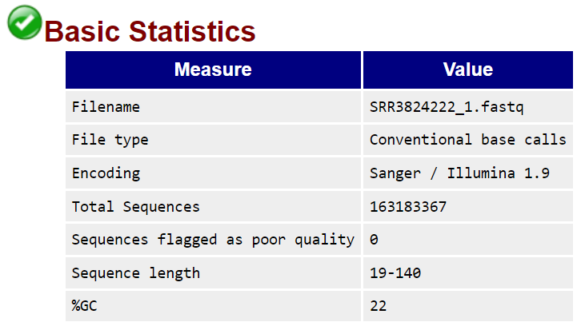 | 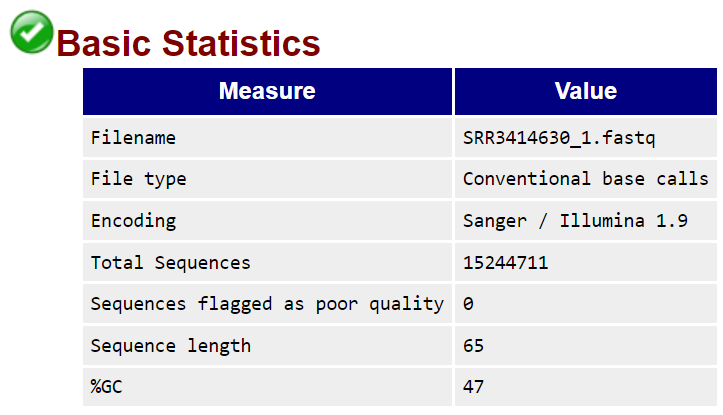 |
| Per base sequence quality    | 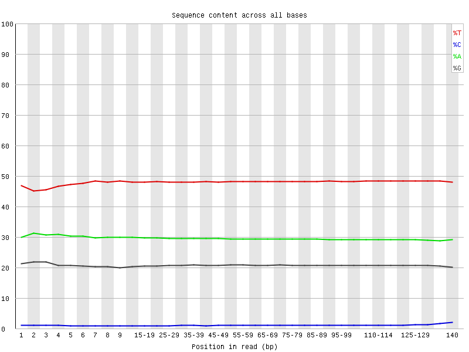     | 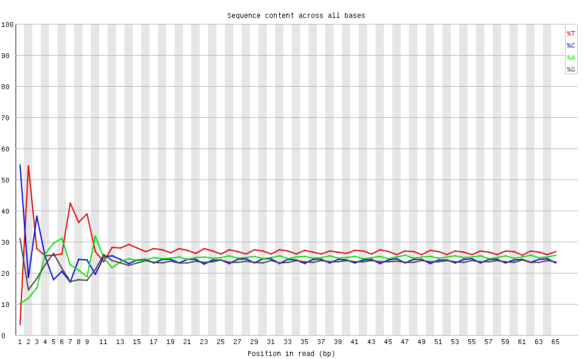     |
| Per sequence GC content      | 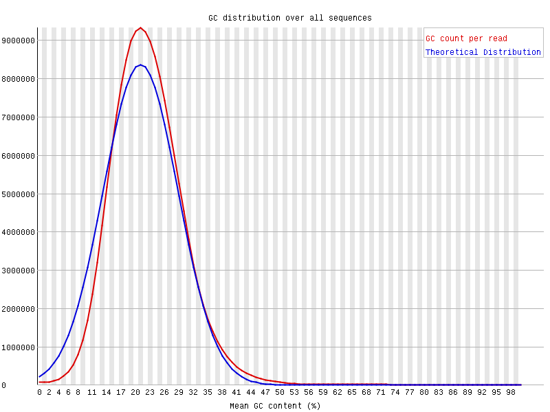       | 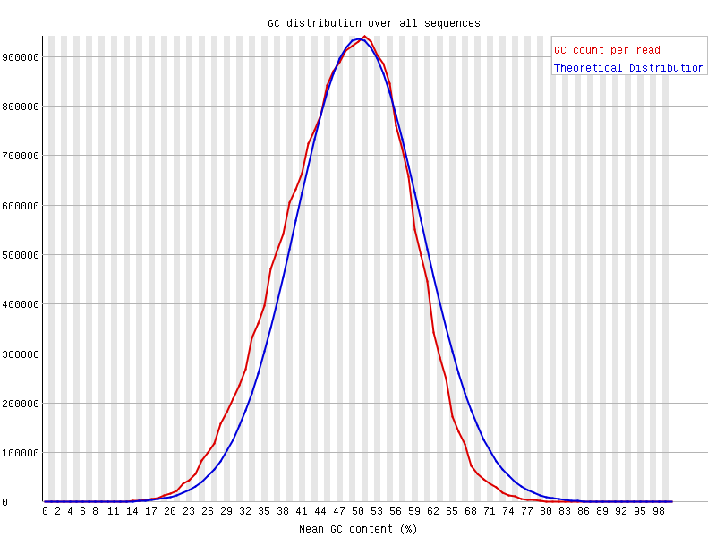       |

В _Basic statistics_ видим: в _SRR3824222_ процент GC в два раза меньше (47/22), чем у второго образца.

В _Per base sequence quality_ видно, что для _SRR3824222_ уровень цитозинов значительно ниже, чем для _SRR3414630_ — он почти нулевой; cодержание гуанина, также ниже чем в _SRR3414630_. Притом, что уровень аденина примерно равен, тимина в _SRR3824222_ заметно больше. Это напрямую соотносится с наблюдениями для _Basic statistics_.

В _Per sequence GC content_ есть видимое различие: нормельное распределение смещено левее для _SRR3824222_.

## Риды

|  Sequence  | _11347700-11367700_ | _40185800-40195800_ | Deduplication |
|:----------:|:-------------------:|:-------------------:|:-------------:|
| SRR3824222 | 2328                | 1062                | 97.08%        |
| SRR5836473 | 1090                | 464                 | 81.69%        |
| SRR5836475 | 1456                | 630                 | 90.92%        |

## M-Bias

В таблице ниже приведен график смещения метилирования. На изображениях показана доля метилирования в каждой позиции в прочтениях и абсолютное значение метилированных и неметилированных (метиловых) calls. Так как это paired-end запись, получено по два отличных M-bias графика. На них видно смещение начальных значений ("3'-end-repair") в двух прочтениях paired-end reads.

| Последовательность | 1 рид                                                  | 2 рид                                                  |
|:------------------:|:------------------------------------------------------:|:------------------------------------------------------:|
| SRR3824222         | 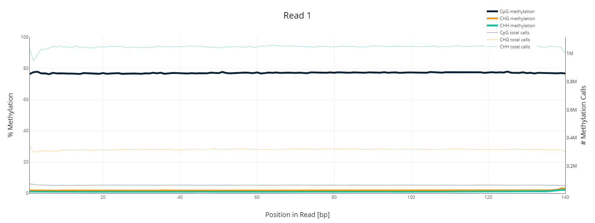      | 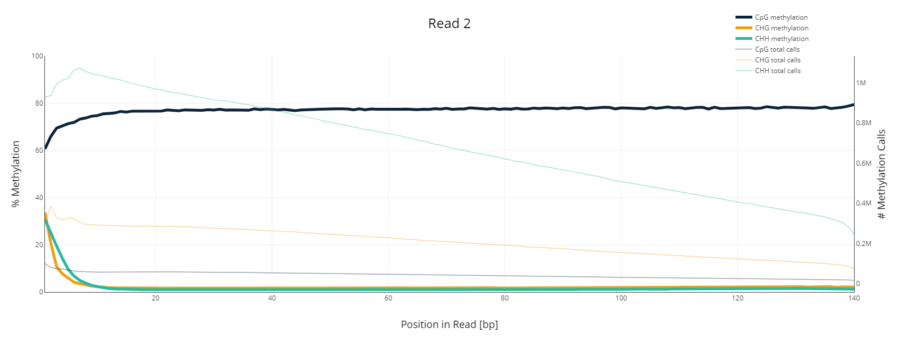      |
| SRR5836473         | 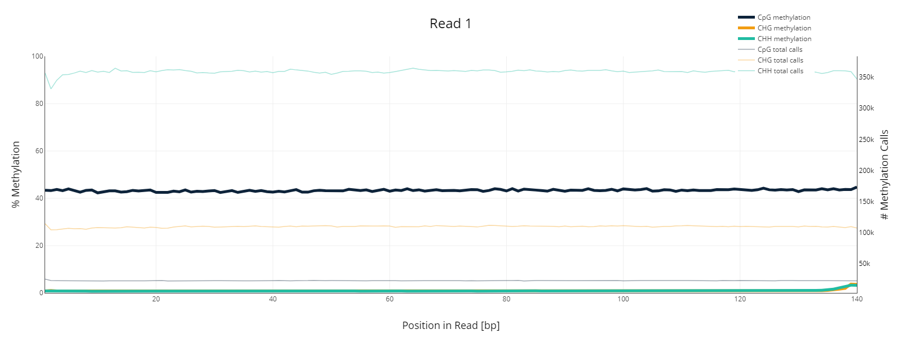      | 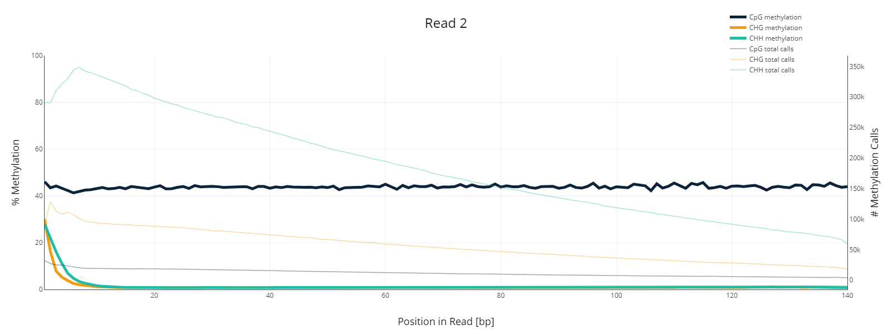      |
| SRR5836475         | 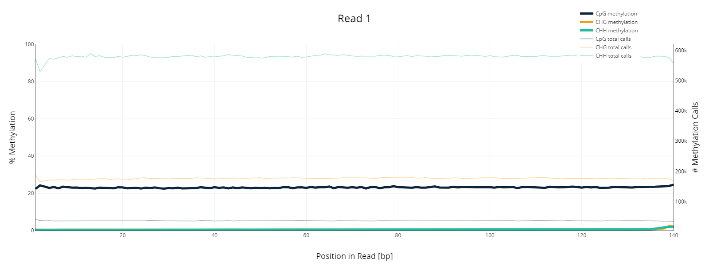      | 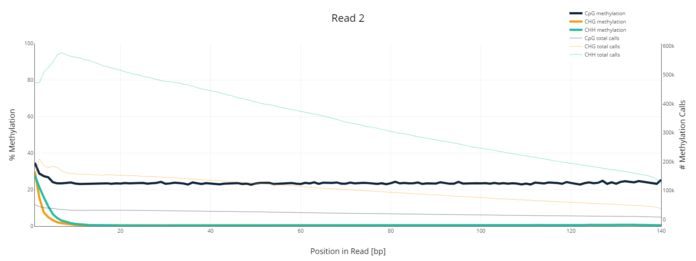      |

## Распределение метелирования цитозинов по хромосоме

_Отрисовка гистограм:_

```
import pandas as pd
from matplotlib import pyplot as plt

def draw(id):
  path = f'/content/{id}/s_{id}_1_bismark_bt2_pe.deduplicated.bedGraph'
  bg = pd.read_csv(path,  delimiter='\t', skiprows=1, header=None)
  with plt.style.context('seaborn-white'):  
    fig = plt.figure(figsize=(15, 6))
    plt.title(id) 
    plt.hist(bg[3], bins=100, density=True)
    plt.xlabel('Percentage of methylated cytosines')
    plt.ylabel('Frequency')
    plt.grid(True)
    plt.show()

for i in ['SRR3824222', 'SRR5836473', 'SRR5836475']:
  draw(i)
```

| **Epiblast**                | **8cell**                   | **ICM**                     |
|:---------------------------:|:---------------------------:|:---------------------------:|
| 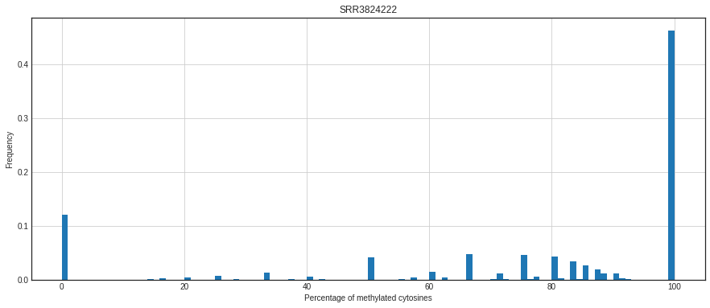 | 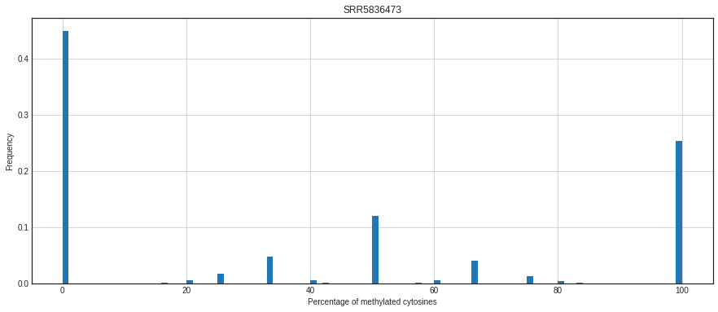 | 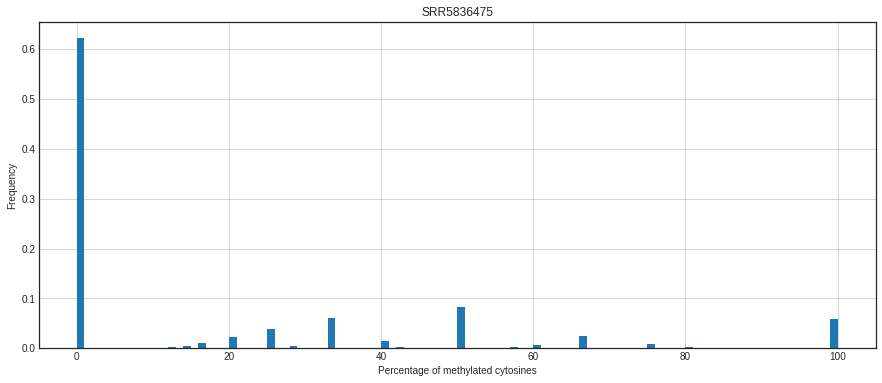 |

## Уровень метелирования и покрытия

для _chr11:3100030-3400030_

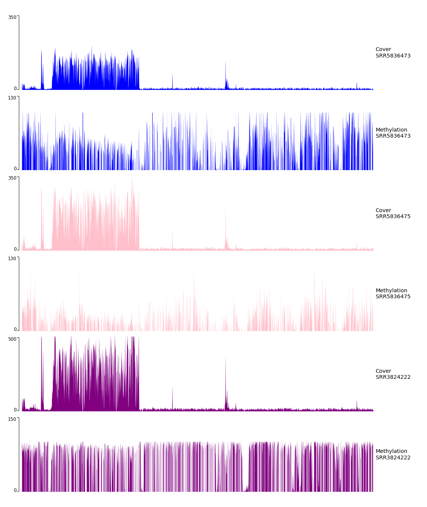
